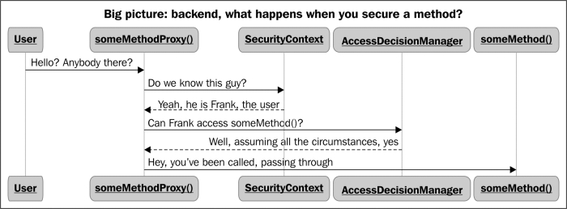

# Security Project

## Goals

* Learn about security design & auditing
* Learn about cryptography
* Apply to a near real world example

## Interesting?

* Blockchain examples
* Crypto-currency
* Payment Gateways
* Applying financial / auditing principles
* Roles, Role based access controls
* API's / Secure API's
* LDAP / Identity Server
* Docker, Vagrant, Packer - secure build pipelines

## Who are my roles?

- identification (OAuth2)
Customer 
ProductAdmin
FinanceAdmin
SuperUser

## What are my resources

* Product/{id}/questions/{id}
* Product/{id}/options/{id}

## Permissions on those resources

* Customer - GET Questions for my Product
* Customer - GET Options for my product
* ProductAdmin - Modify Questions, Create Product , Create Questions, Remove questions
* FinanceAdmin - Modify Options, Create Options
* SuperUser - Everything

# Basic Authentication Flow

# References

Spring security essentials
7 layers of financial governance
Freicoin

## Technical

maven - keytool - control certificate generation

OpenLDAP - Docker

